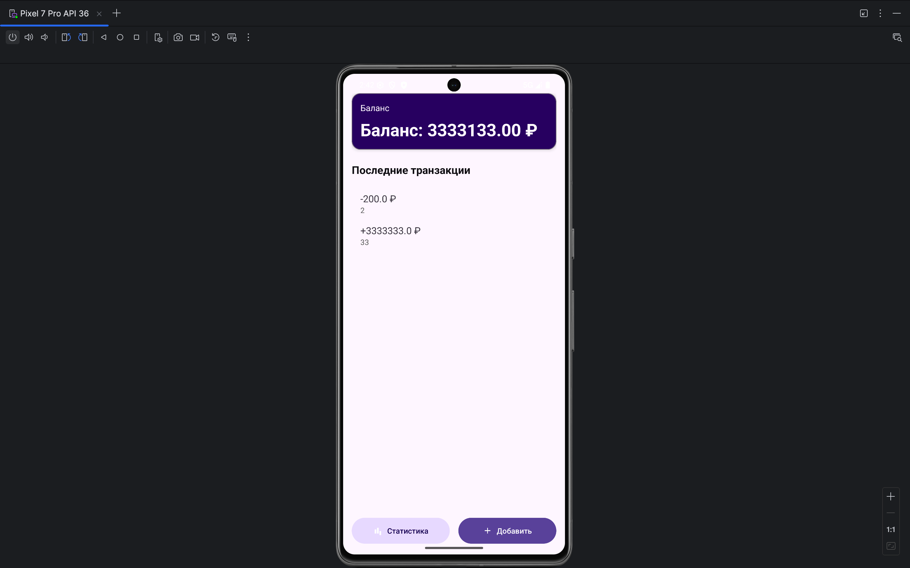

Финансовый трекер (Money Tracker)

> Приложение для учета доходов и расходов с современным дизайном Material Design 3 и архитектурой MVVM.


📌 Описание

Финансовый трекер — это простое, но мощное приложение для отслеживания личных финансов. Вы можете добавлять доходы и расходы, просматривать баланс, редактировать и удалять транзакции, а также получать статистику по категориям.


✅ Функционал

- Добавление транзакций: доходы и расходы с категориями
- Баланс в реальном времени: автоматический расчет на основе всех транзакций
- Редактирование и удаление: изменяйте или удаляйте ранее добавленные записи
- Статистика: текстовая аналитика доходов и расходов (без графиков)
- Категории: базовые категории для удобного группирования трат
- Материал-дизайн: современный интерфейс с поддержкой светлой/темной темы


🧰 Технологии

| Технология | Описание |
|-----------|----------|
| Java | Основной язык разработки |
| Android Studio | IDE для разработки |
| Room Database | Локальное хранение данных |
| ViewModel + LiveData | MVVM архитектура |
| RecyclerView | Отображение списка транзакций |
| Material Design 3 | Современный UI/UX |
| ConstraintLayout / NestedScrollView | Гибкая разметка |


📁 Структура проекта

```
moneytracker/
├── app/
│   ├── src/
│   │   ├── main/
│   │   │   ├── java/wi/exest/moneytracker/
│   │   │   │   ├── data/
│   │   │   │   │   └── local/TransactionEntity.java
│   │   │   │   │   └── AppDatabase.java
│   │   │   │   ├── ui/
│   │   │   │   │   ├── main/MainFragment.java
│   │   │   │   │   └── add/AddTransactionFragment.java
│   │   │   │   └── util/Constants.java
│   │   │   └── res/
│   │   │       ├── layout/
│   │   │       │   ├── fragment_main.xml
│   │   │       │   └── item_transaction.xml
│   │   │       └── values/
│   │   │           ├── colors.xml
│   │   │           └── themes.xml
│   │   └── build.gradle (Module: app)
│   └── build.gradle (Project)
└── README.md
```


🛠️ Как запустить проект

Предварительные требования:
- [Android Studio](https://developer.android.com/studio)
- Android SDK (минимум API 24+)
- Java 11+

Шаги:
1. Клонируйте репозиторий:
   ```bash
   https://github.com/WeiReXZ/Moneytracker.git


2. Откройте проект в Android Studio
3. Синхронизируйте Gradle (`File > Sync Project with Gradle Files`)
4. Запустите приложение на эмуляторе или устройстве


📱 Экраны приложения

| Экран | Описание |
|-------|----------|
| Главная | Список транзакций, баланс, кнопки добавления и статистики |
| Добавление | Форма для ввода суммы, категории, типа (доход/расход) |
| Редактирование| Возможность изменения существующей транзакции |
| Статистика | Текстовая аналитика доходов и расходов |


📐 Архитектура проекта (MVVM)


Repository → ViewModel → View


- Model: `TransactionEntity`, `AppDatabase`, `TransactionDao`
- ViewModel: `MainViewModel`, `AddTransactionViewModel`
- View: `MainFragment`, `AddTransactionFragment`, `StatisticsFragment`
- Utils: `Constants.java`, `TransactionAdapter.java`


🎨 Цвета и темы

Цвета (Material 3)
| Цвет | Использование |
|------|---------------|
| `colorPrimary` | Кнопки, акценты |
| `colorSurface` | Фон элементов |
| `colorOnSurface` | Текст на фоне |
| `incomeGreen` | Цвет для доходов |
| `expenseRed` | Цвет для расходов |
---


📸 Скриншоты

<div align="center">
  
  
  
</div>
